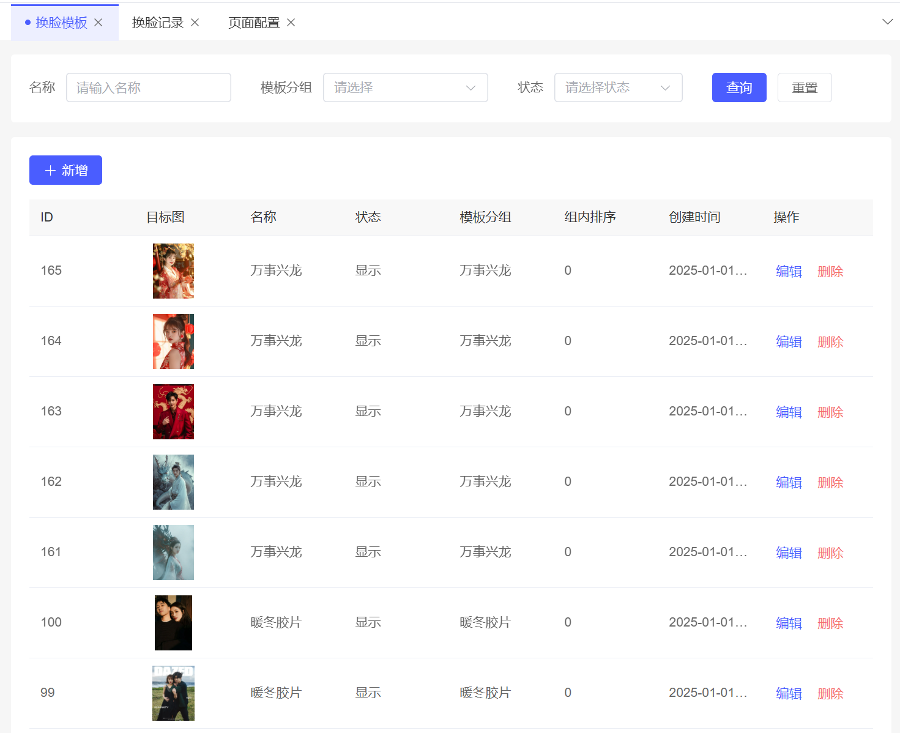
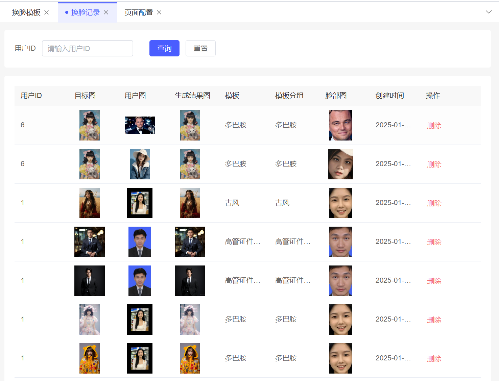
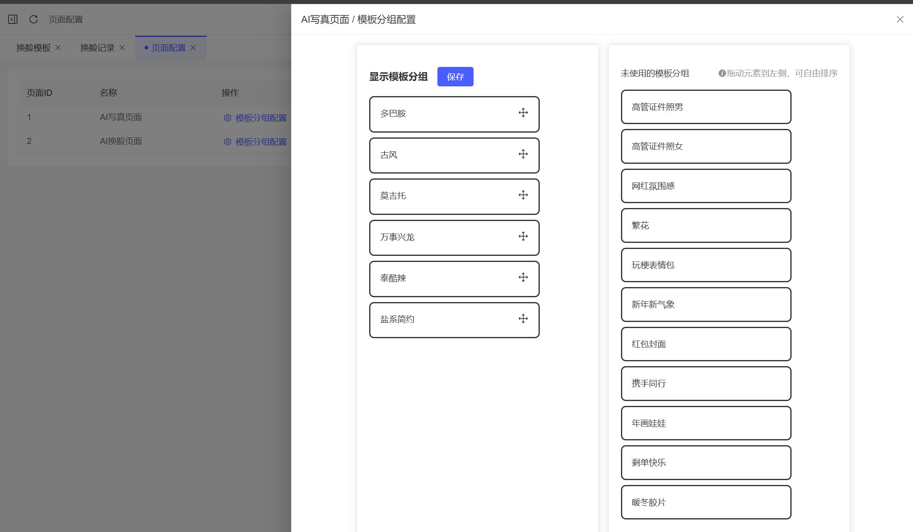
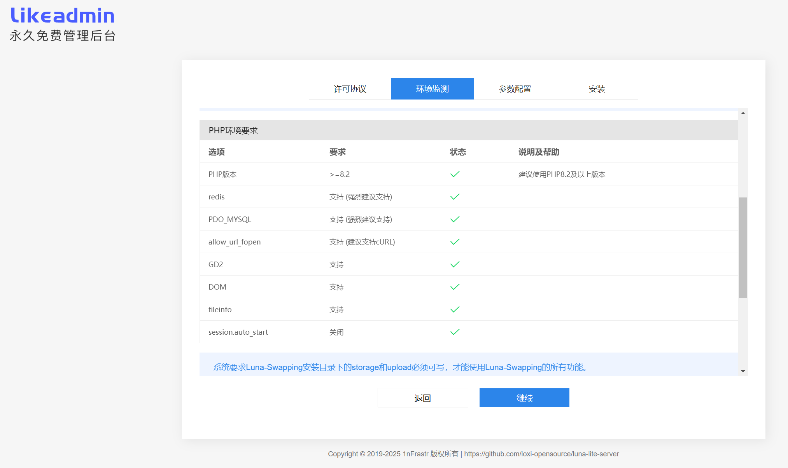

	

<h1 align="center" style="margin: 10px 0 10px; font-weight: bold;">Luna AI换脸【Lite版】</h1>
<h3 align="center" style="margin-bottom: 10px;">快速、轻量的AI换脸解决方案</h3>

## 为什么有Lite版本？

## 简介

- 基础能力：AI换脸、AI写真、AI证件照、恶搞表情包、网红氛围感换脸
- 算法能力：内置商汤科技换脸算法API，可自行对接其他第三方模型
- 数字分身：仅需1张正脸照制作数字分身，用户可管理删除
- 模板管理：支持自定义模板底图，设置模板排序，页面装修
- TODO 付费方式：支持微信小程序支付，充值购买点数
- TODO 多人换脸：支持多人合影、情侣合照、明星合影、宠物合影

## 演示

<table>
    <tr>
        <td width="30%">
            
            
微信小程序

        </td>
        <td>
            

                <a href="https://luna-swapping-lite.sodair.top/admin">管理后台演示环境</a> 账号密码：demo / 123456
            

            

                基于 <a href="https://github.com/1nFrastr/likeadmin_laravel">Likeadmin-Laravel</a> 全栈开发框架构建
            

        </td>
    </tr>
</table>

### 后台演示图

<table>
	<tr>
        <td width="20%">换脸模板</td>
        <td></td>
    </tr>
	<tr>
        <td>换脸记录</td>
        <td></td>
    </tr>
	<tr>
        <td>页面装修</td>
        <td></td>
    </tr>
	<tr>
        <td>安装引导页</td>
        <td></td>
    </tr>
</table>

## 部署教程

**说明**

Lite版本的前后端代码分开3个仓库单独维护，以服务端项目作为主仓库。

每一个版本的安装包只会在主仓库Release页面发布更新。

Release发行版打包了前后端构建之后的完整源码，提供傻瓜式的安装引导Web页面，不再需要自己打包各端源码！

**关联项目**

主仓库 - 服务端源码： [luna-lite-server](https://github.com/loxi-opensource/luna-lite-server)

关联仓库 - 小程序源码： [luna-lite-uniapp](https://github.com/loxi-opensource/luna-lite-uniapp)

关联仓库 - 管理后台源码： [luna-lite-admin](https://github.com/loxi-opensource/luna-lite-admin)

算法服务：需付费购买第三方API服务，目前已对接商汤科技换脸API

## 常见问题

换脸算法开源吗？
- 这是应用层代码，可自行接入第三方换脸API

平均出图时间要多久？
- 生成1张图效果图大概需要5秒左右

换脸内容有什么限制吗？
- 不允许上传涉黄、涉政、明星、公众人物等不合规内容

用户可以自定义目标底图吗？
- 不允许用户自行上传换脸目标图，但系统管理员可以在后台上架管理换脸模板

## 联系方式

<table>
<tr>
    <td>
        
    </td>
</tr>
</table>
