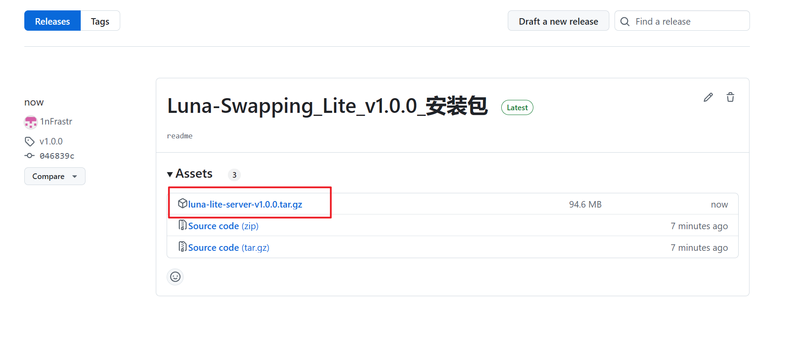
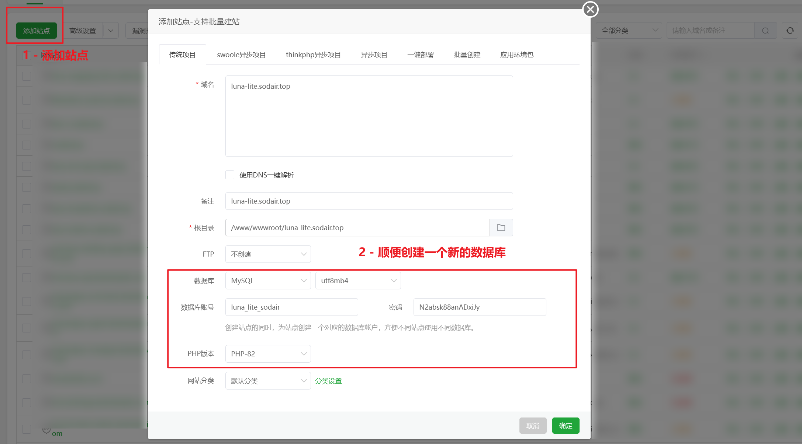
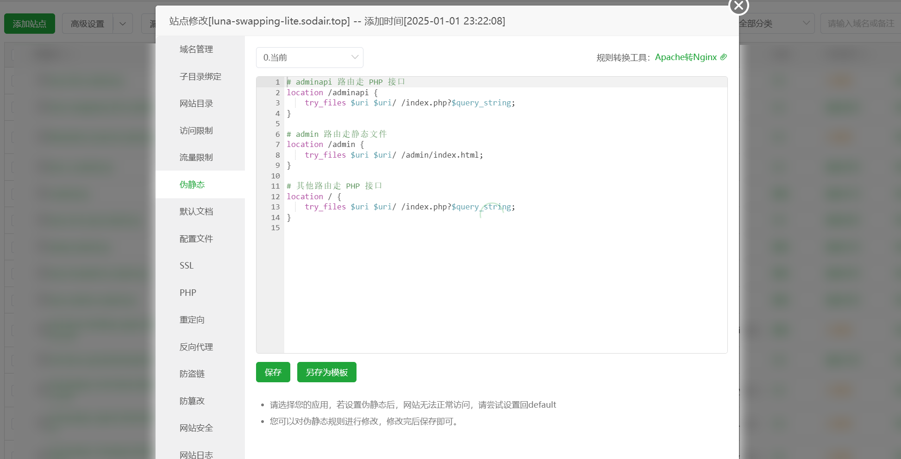
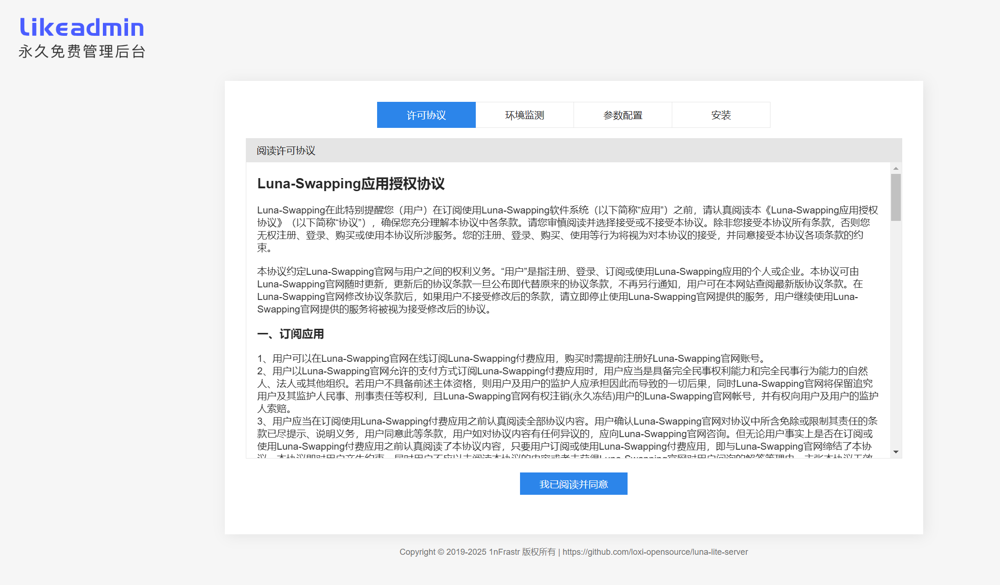
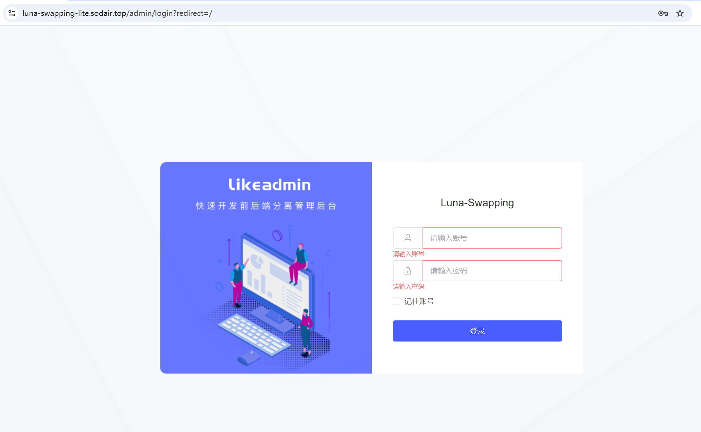
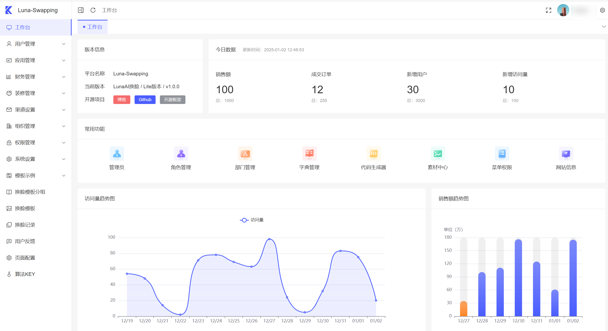
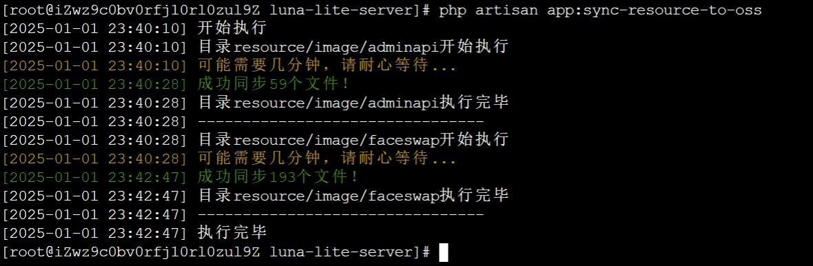
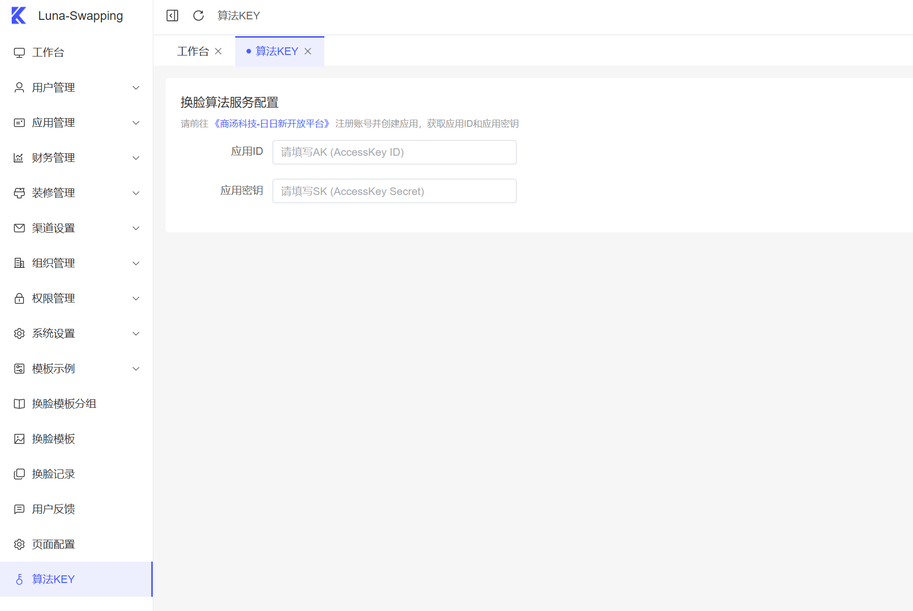

# LunaSwapping Lite版本部署文档

## 0. 介绍

本项目基于 <a href="https://github.com/1nFrastr/likeadmin_laravel">Likeadmin-Laravel</a> 全栈开发框架构建。

## 1. 环境要求

- PHP 8.2
- MySQL 8.0
- Nginx服务器
- Redis缓存
- 云服务依赖：阿里云OSS、商汤科技换脸算法KEY、微信小程序账号

下面以宝塔面板为例，介绍如何部署完整的前后端项目。

## 2. 安装基础环境

宝塔软件商店，找到PHP8.2、MySQL8.0、Redis、Nginx等软件，下载安装

**配置PHP**：需要安装以下扩展：

- fileinfo扩展
- redis扩展

## 3. 下载项目代码

到项目 [Release页面](https://github.com/loxi-opensource/luna-lite-server/releases) 下载最新安装包到服务器，解压到指定目录如 `/www/wwwroot/luna-lite-server`



## 4. 配置Nginx
1. 网站域名创建（确保域名已经解析到服务器IP地址）

    
2. 网站目录设置：网站目录按实际选择本项目代码在服务器上的绝对路径，运行目录选择`public`

   
3. 配置伪静态规则

   
   
    ```
    # adminapi 路由走 PHP 接口
    location /adminapi {
        try_files $uri $uri/ /index.php?$query_string;
    }
    
    # admin 路由走静态文件
    location /admin {
        try_files $uri $uri/ /admin/index.html;
    }
    
    # 其他路由走 PHP 接口
    location / {
        try_files $uri $uri/ /index.php?$query_string;
    }
    ```
4. 配置HTTPS协议证书【可选，但强烈推荐使用免费SSL证书】
5. 访问域名网址，如果配置没问题会进入LunaSwapping的安装引导页面
 
    

## 5. 安装项目

安装引导页面会引导你完成以下操作：

- 检查服器环境、PHP环境
- 配置数据库连接
- 配置缓存连接
- 配置后台管理员账号
- 自动导入数据库文件
- 完成安装

如果一切正常，可以跟随指引跳转到后台登录页面。账号密码是刚才再安装引导页面设置的管理员账号。



登录成功后，进入管理后台页面：



## 6. 配置应用

进入管理后台，依次配置以下参数：

1. 微信小程序参数配置（后台菜单：渠道设置 / 微信小程序） 
2. 阿里云OSS云存储配置（后台菜单：系统设置 / 存储设置）
3. 同步本地资源到阿里云OSS。宝塔终端进入项目根目录，执行以下命令：
```shell
php artisan app:sync-resource-to-oss
```

说明：
- 本项目必须使用阿里云OSS，暂不支持其他云存储。原因是数字分身功能涉及到人脸裁剪，依赖阿里云OSS的图片处理功能。
- 请确保php的命令行版本是8.2，再执行上述命令。可以输入`php -v`查看php版本。
- 必须同步本地资源（主要是示例换脸模板文件）到阿里云OSS! 否则可能换脸功能无法正常使用。命令运行成功截图：
  

## 7. 配置换脸算法KEY

请前往<a href="https://signin.sensecore.cn/?login_challenge" target="_blank">《商汤科技-日日新开放平台》</a>注册账号并创建应用，获取应用ID和应用密钥。

目前不支持自主购买，需在申请AK和SK之后联系他们的商务对接同学开通。详情参考[飞书文档](https://iwqiw8uo3k0.feishu.cn/docx/ElnKdsKH1oQsA5x5X2ocFTcTnLg)

商汤科技对接同学在微信交流群里。找到对接同学，告诉他们你的应用ID，让他们帮你开通换脸算法服务。

换脸算法服务开通成功后，然后在后台配置。后台菜单：算法KEY



## 7. 小程序本地开发运行教程

关联仓库 - 小程序源码： [luna-lite-uniapp](https://github.com/loxi-opensource/luna-lite-uniapp)

1. Git克隆项目到本地
2. `yarn install` 安装依赖 
3. 复制`.env.development.example`为`.env.development`
4. 修改`.env.development`文件的VITE_API_URL为你的服务端API地址，带HTTP协议前缀，不带斜杠后缀，例如`VITE_API_URL='https://luna-swapping-lite.sodair.top'`
5. 修改`src/manifest.json`文件的`appid`为你的小程序appid
    ```
      /* 小程序特有相关 */
      "mp-weixin": {
        "appid": "wxcda4ee7fa639530f",
        "setting": {
          "urlCheck": false
        },
        "usingComponents": true
      },
    ```
6. 运行`yarn dev:mp-weixin`启动服务
7. 使用微信开发者工具打开项目，选择`dist/dev/mp-weixin`目录
8. 正常打开能获取到后端数据，说明本地开发环境配置成功
